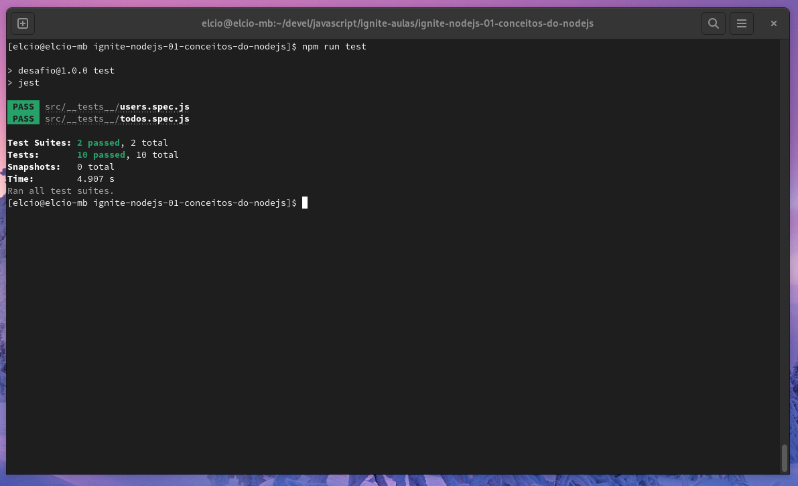

# Ignite NodeJS - Desafio 01 - Conceitos do Node.js
## Sobre o desafio

Criar uma aplicação para treinar os conceitos do Node.js

Simular uma aplicação para gerenciar tarefas (*todos*). 

A aplicacao irá permitir a criação de um usuário com `name` e `username`, bem como fazer o CRUD de *todos*:

- Criar um novo *todo*;
- Listar todos os *todos*;
- Alterar o `title` e `deadline` de um *todo* existente;
- Marcar um *todo* como feito;
- Excluir um *todo*;

O `username` será passado pelo header da requisição.

## Exemplo do objeto users

```
const users = [
  {
    id: uuidv4(),
    name: "Elcio Sato",
    username: "elcio",
    todos: [
      {
        id: uuidv4(),
        title: "Desafio 01 - Ignite NodeJS",
        done: false,
        deadline: '2022-10-27T00:00:00.000Z',
        created_at: '2022-10-07T00:00:00.000Z'
      },
      {
        id: "e9eef8f3-8c2d-451d-a4c1-69f297e336d1",
        title: "Estudar JavaScript",
        done: false,
        deadline: '2022-10-27T00:00:00.000Z',
        created_at: '2022-10-07T00:00:00.000Z'
      },
    ]
  }
];
```

## Destaques

>Utilizacão de um midleware para validacao da existencia do `username` que foi repassado para aplicacao dentro do header da requisicao.

```
function checksExistsUserAccount(request, response, next) {
  // Complete aqui
  const { username } = request.headers;
  const user = users.find(usr => usr.username === username);
  if (user) {
    request.user = user;
    next();
  } else {
    return response.status(404).json({ error: "Username not found!" })
  }
}
```


>Validação dos requisitos e regras de negócios através de testes automatizados. 
Segue abaixo os resultados da execucao dos testes:



## Tecnologias

- JavaScript
- NodeJS
- express
- Git
- Github

## Contato

elciosato@gmail.com